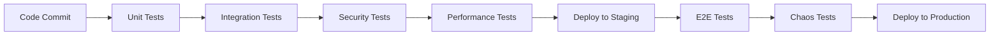

# Comprehensive Test Strategy for Critical Paths
## Phase 6 AQE Pipeline Remediation

### Test Framework Architecture

```mermaid
graph TB
    A[Test Strategy] --> B[Unit Tests]
    A --> C[Integration Tests]
    A --> D[E2E Tests]
    A --> E[Security Tests]
    A --> F[Performance Tests]
    A --> G[Chaos Tests]

    B --> B1[Truth Verification]
    B --> B2[Auth & AuthZ]
    B --> B3[Database Management]
    B --> B4[ML Pipeline]
    B --> B5[Security Scanning]
    B --> B6[Rate Limiting]
    B --> B7[Error Handling]
    B --> B8[Session Management]
    B --> B9[File Operations]
    B --> B10[Background Jobs]
    B --> B11[Configuration]
    B --> B12[WebSocket]

    C --> C1[Component Interaction]
    C --> C2[Data Flow]
    C --> C3[External Services]
    C --> C4[Configuration Loading]

    D --> D1[User Workflows]
    D --> D2[System Behavior]
    D --> D3[Load Scenarios]
    D --> D4[Failure Recovery]

    E --> E1[Auth Bypass]
    E --> E2[Privilege Escalation]
    E --> E3[Input Validation]
    E --> E4[Resource Exhaustion]

    F --> F1[Load Testing]
    F --> F2[Stress Testing]
    F --> F3[Memory Analysis]
    F --> F4[Response Time]

    G --> G1[Failure Simulation]
    G --> G2[Network Issues]
    G --> G3[Resource Depletion]
    G --> G4[Chaos Engineering]
```



## Testing Approach by Path Type

### 1. Truth Verification Core Logic Testing

#### Unit Tests
```typescript
describe('TruthVerification Core Logic', () => {
  describe('Threshold Enforcement', () => {
    it('should enforce 0.95 threshold strictly', async () => {
      // Test exact boundary conditions
    });

    it('should reject scores below threshold', async () => {
      // Test failing verification
    });

    it('should accept scores at or above threshold', async () => {
      // Test passing verification
    });
  });

  describe('Consensus Algorithm', () => {
    it('should handle Byzantine failures', async () => {
      // Test consensus with malicious agents
    });

    it('should reach consensus with honest agents', async () => {
      // Test normal consensus flow
    });
  });
});
```

#### Security Tests
- Rule execution injection attacks
- Timing attack mitigation
- Resource exhaustion protection
- Input sanitization

#### Performance Tests
- Large codebase processing time
- Memory usage under load
- Concurrent verification processing

### 2. Authentication & Authorization Flow Testing

#### Unit Tests
```typescript
describe('Authentication & Authorization', () => {
  describe('JWT Validation', () => {
    it('should reject expired tokens', async () => {
      // Test token expiration
    });

    it('should reject invalid signatures', async () => {
      // Test signature validation
    });

    it('should reject malformed tokens', async () => {
      // Test malformed JWT handling
    });
  });

  describe('RBAC Authorization', () => {
    it('should enforce role-based permissions', async () => {
      // Test role enforcement
    });

    it('should prevent privilege escalation', async () => {
      // Test escalation attempts
    });
  });
});
```

#### Security Tests
- JWT secret brute force attacks
- Session hijacking prevention
- Rate limiting bypass attempts
- Password timing attacks

#### Performance Tests
- Token generation performance
- Permission check latency
- Concurrent authentication requests

### 3. Database Connection Management Testing

#### Unit Tests
```typescript
describe('Database Connection Management', () => {
  describe('Connection Pooling', () => {
    it('should handle connection exhaustion', async () => {
      // Test pool exhaustion scenarios
    });

    it('should properly release connections', async () => {
      // Test connection cleanup
    });
  });

  describe('Transaction Management', () => {
    it('should handle deadlock scenarios', async () => {
      // Test deadlock resolution
    });

    it('should rollback failed transactions', async () => {
      // Test rollback mechanisms
    });
  });
});
```

#### Security Tests
- SQL injection prevention
- Connection string security
- Query parameter validation

#### Performance Tests
- Connection pool efficiency
- Query execution time
- Transaction throughput

### 4. ML Pipeline Training & Inference Testing

#### Unit Tests
```typescript
describe('ML Pipeline Manager', () => {
  describe('Model Training', () => {
    it('should handle training failures gracefully', async () => {
      // Test training error handling
    });

    it('should manage memory during training', async () => {
      // Test memory usage
    });
  });

  describe('Model Inference', () => {
    it('should handle inference timeouts', async () => {
      // Test timeout handling
    });

    it('should validate input data', async () => {
      // Test input validation
    });
  });
});
```

#### Security Tests
- Model poisoning detection
- Adversarial input handling
- Data privacy protection
- Resource exhaustion prevention

#### Performance Tests
- Training completion time
- Inference latency
- Memory usage analysis
- GPU utilization

### 5. Security Scanning Engine Testing

#### Unit Tests
```typescript
describe('Security Scanning Engine', () => {
  describe('Vulnerability Detection', () => {
    it('should detect common vulnerabilities', async () => {
      // Test vulnerability detection
    });

    it('should avoid false negatives', async () => {
      // Test detection accuracy
    });
  });

  describe('Performance', () => {
    it('should handle large codebases', async () => {
      // Test scalability
    });
  });
});
```

#### Security Tests
- Scanner evasion techniques
- Path traversal prevention
- Information leakage protection
- DoS attack resistance

#### Performance Tests
- Scan completion time
- Memory usage analysis
- Concurrent scanning capability

### 6. API Rate Limiting & Throttling Testing

#### Unit Tests
```typescript
describe('Rate Limiting', () => {
  describe('Rate Enforcement', () => {
    it('should limit requests per IP', async () => {
      // Test IP-based limiting
    });

    it('should handle distributed attacks', async () => {
      // test distributed attack detection
    });
  });
});
```

#### Security Tests
- Rate limit bypass attempts
- IP spoofing protection
- Distributed attack coordination

#### Performance Tests
- Rate lookup performance
- Memory usage efficiency
- Concurrent request handling

### 7. Error Handling & Recovery Testing

#### Unit Tests
```typescript
describe('Error Handling & Recovery', () => {
  describe('Exception Handling', () => {
    it('should catch all exceptions', async () => {
      // Test exception catching
    });

    it('should not leak sensitive information', async () => {
      // Test information security
    });
  });
});
```

#### Security Tests
- Information leakage prevention
- Error message injection protection
- Stack trace security

#### Performance Tests
- Error handling overhead
- Recovery time measurement
- Resource cleanup efficiency

### 8. Session Management Testing

#### Unit Tests
```typescript
describe('Session Management', () => {
  describe('Session Security', () => {
    it('should prevent session fixation', async () => {
      // Test session fixation prevention
    });

    it('should expire sessions properly', async () => {
      // Test session expiration
    });
  });
});
```

#### Security Tests
- Session hijacking prevention
- Session fixation protection
- CSRF token validation

#### Performance Tests
- Session lookup performance
- Memory usage analysis
- Cleanup efficiency

### 9. File Upload/Download Testing

#### Unit Tests
```typescript
describe('File Operations', () => {
  describe('File Upload', () => {
    it('should validate file types', async () => {
      // Test file type validation
    });

    it('should prevent path traversal', async () => {
      // Test path traversal prevention
    });
  });
});
```

#### Security Tests
- Malware upload prevention
- File type bypass protection
- Disk space protection

#### Performance Tests
- Upload processing time
- Download speed analysis
- Storage efficiency

### 10. Background Job Processing Testing

#### Unit Tests
```typescript
describe('Background Jobs', () => {
  describe('Job Processing', () => {
    it('should handle job failures', async () => {
      // Test failure handling
    });

    it('should prevent job duplication', async () => {
      // Test idempotency
    });
  });
});
```

#### Security Tests
- Job injection prevention
- Privilege escalation protection
- Data security in jobs

#### Performance Tests
- Job processing throughput
- Memory usage analysis
- Queue efficiency

### 11. System Configuration Testing

#### Unit Tests
```typescript
describe('Configuration Management', () => {
  describe('Config Validation', () => {
    it('should validate configuration values', async () => {
      // Test config validation
    });

    it('should protect sensitive values', async () => {
      // Test secret protection
    });
  });
});
```

#### Security Tests
- Configuration injection prevention
- Secret exposure protection
- Config tampering detection

#### Performance Tests
- Configuration loading time
- Hot reload efficiency
- Memory usage analysis

### 12. WebSocket Communication Testing

#### Unit Tests
```typescript
describe('WebSocket Communication', () => {
  describe('Connection Management', () => {
    it('should handle connection limits', async () => {
      // Test connection limits
    });

    it('should authenticate connections', async () => {
      // Test WebSocket auth
    });
  });
});
```

#### Security Tests
- Authentication bypass prevention
- Message injection protection
- DoS attack resistance

#### Performance Tests
- Connection handling capacity
- Message processing speed
- Memory usage efficiency

## Test Execution Strategy

### Automated Testing Pipeline


### Test Categories and Frequency
- **Unit Tests**: Every commit, <5 minutes
- **Integration Tests**: Every PR, <15 minutes
- **Security Tests**: Daily, <30 minutes
- **Performance Tests**: Weekly, <1 hour
- **E2E Tests**: Pre-deployment, <2 hours
- **Chaos Tests**: Production canary, <4 hours

### Quality Gates
- All tests must pass with 95%+ coverage
- Security tests must pass with 100% success
- Performance tests must meet baseline metrics
- No flaky tests (>5% failure rate)

## Test Data Management

### Test Data Strategy
- **Deterministic Data**: Fixed test datasets for reproducibility
- **Synthetic Data**: Generated data for edge cases
- **Production-like Data**: Anonymized production data for realism
- **Malicious Data**: Crafted inputs for security testing

### Data Cleanup
- Automatic cleanup after each test
- Database transactions for test isolation
- File system cleanup for file operation tests
- Memory cleanup for performance tests

## Monitoring and Reporting

### Test Metrics Dashboard
- Test execution time trends
- Coverage metrics over time
- Flaky test identification
- Performance regression detection

### Alerting
- Test failure notifications
- Coverage degradation alerts
- Performance regression warnings
- Security test failure escalations

## Continuous Improvement

### Test Review Process
- Weekly test quality reviews
- Flaky test elimination
- Coverage gap analysis
- Performance optimization

### Test Maintenance
- Regular test suite refactoring
- Test data updates
- Framework upgrades
- Best practice implementation

This comprehensive test strategy ensures robust validation of all critical paths in the Turbo Flow system, with emphasis on security, performance, and reliability.